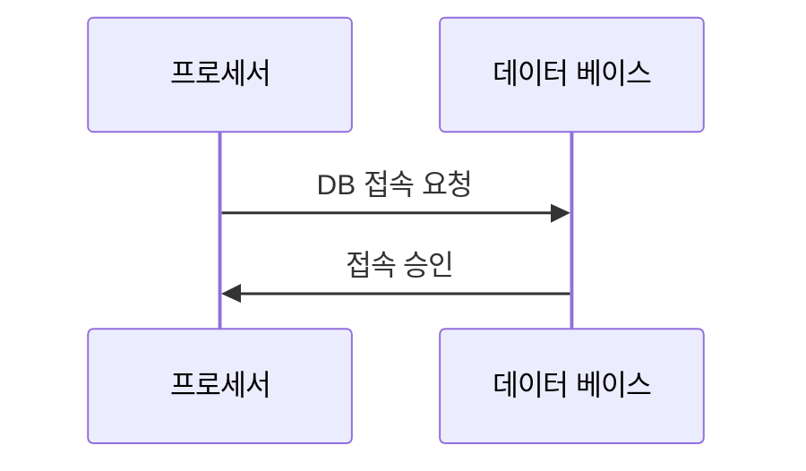
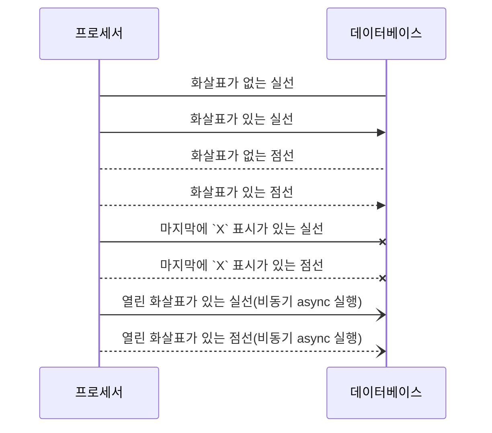
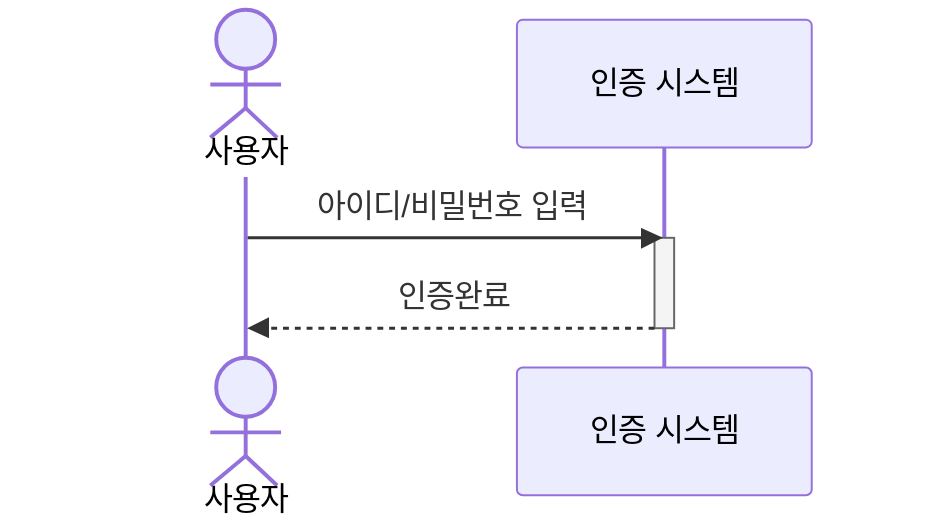
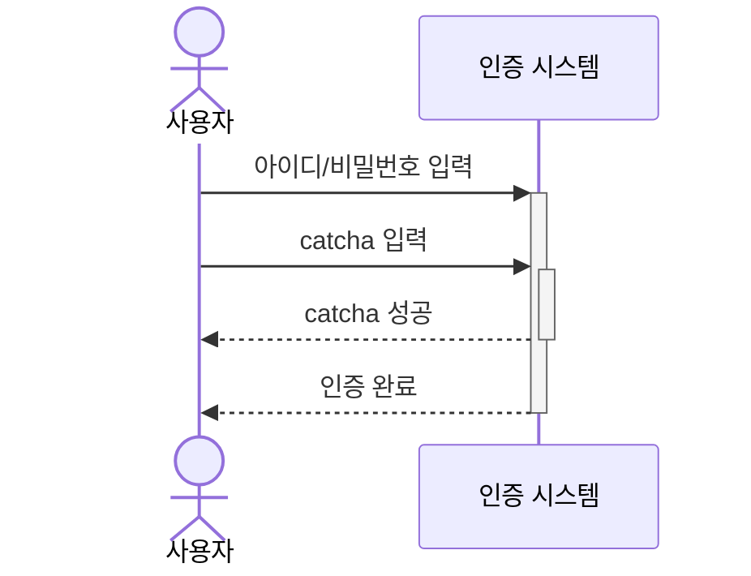
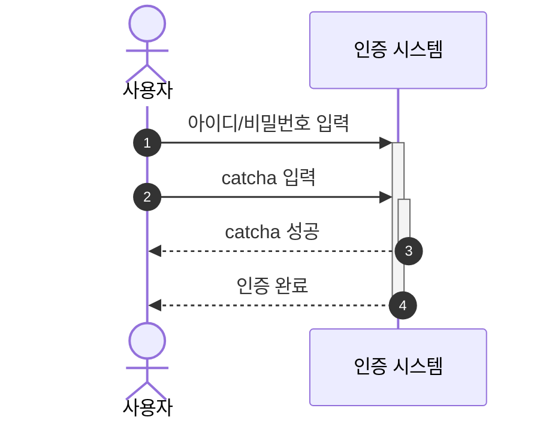
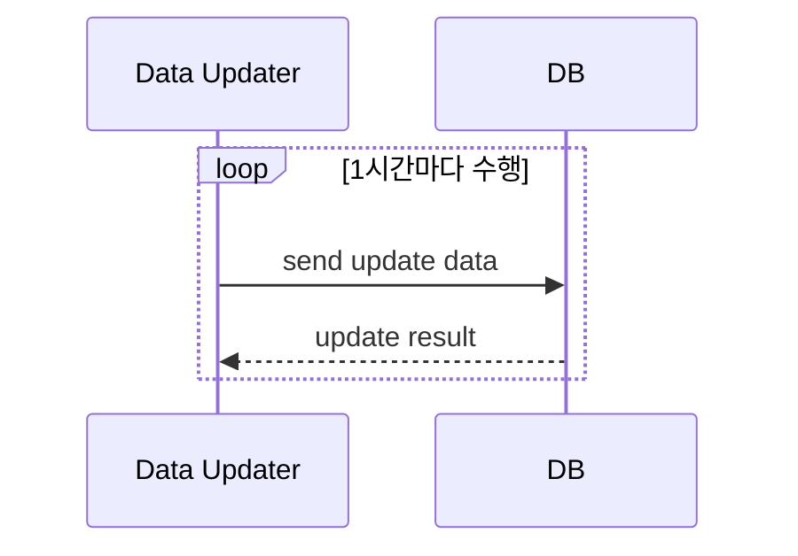
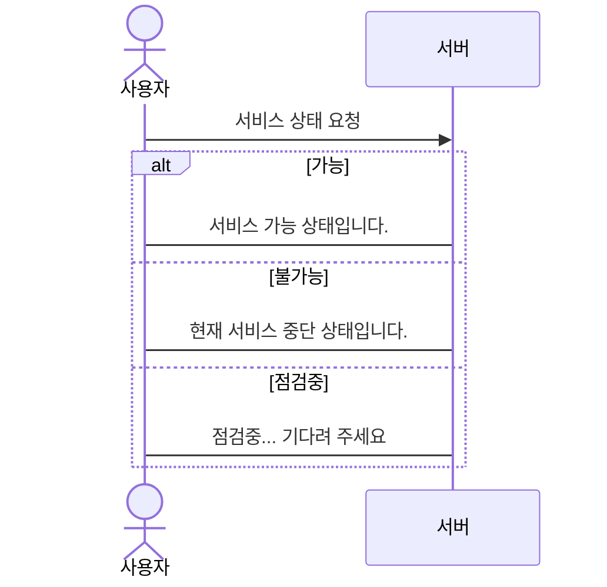
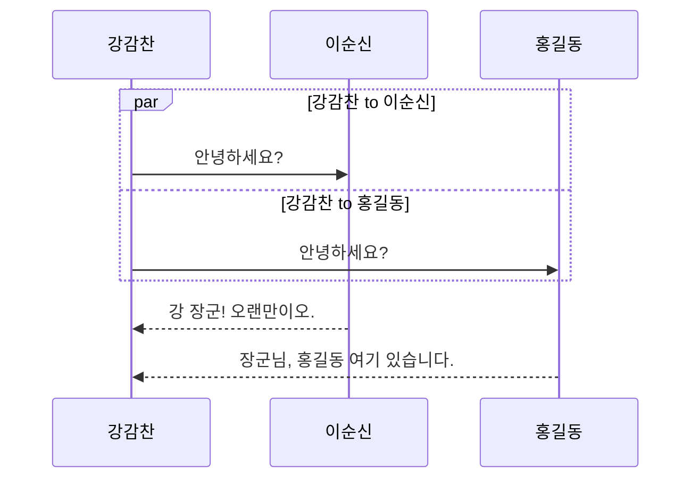
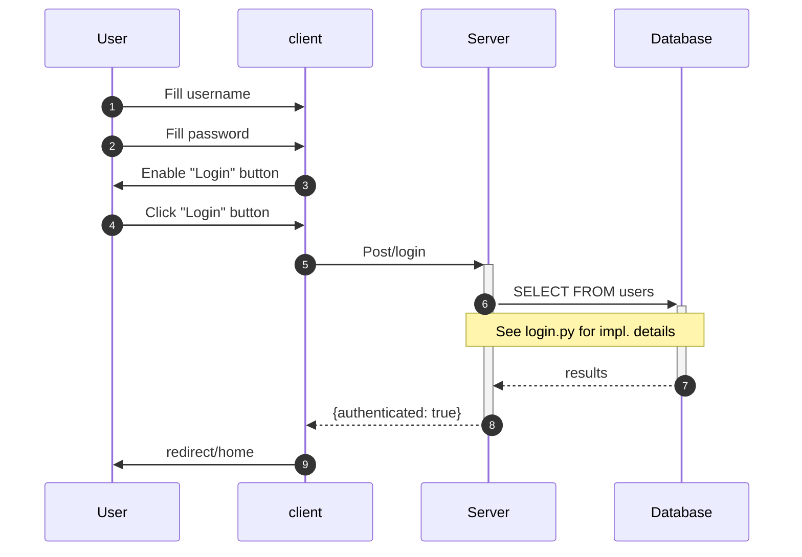

# Mermaid 실습
- 순서도 실습
    - 첫번째 실습

```mermaid
sequenceDiagram
    participant A as 프로세서
    participant B as 데이터 베이스
    A ->> B: DB 접속 요청
    B ->> A: 접속 승인
```

```mermaid
sequenceDiagram
    participant A as 프로세서
    participant B as 데이터베이스
    
    # 연결선 모양
    A -> B: 화살표가 없는 실선
    A ->> B: 화살표가 있는 실선
    A --> B: 화살표가 없는 점선
    A -->> B: 화살표가 있는 점선
    A -x B: 마지막에 `X` 표시가 있는 실선
    A --x B: 마지막에 `X` 표시가 있는 점선
    A -) B: 열린 화살표가 있는 실선(비동기 async 실행)
    A --) B: 열린 화살표가 있는 점선(비동기 async 실행)
```

```mermaid
sequenceDiagram
    actor A as 사용자
    participant B as 인증 시스템
    A ->> B: 아이디/비밀번호 입력
    activate B
    B -->> A: 인증완료
    deactivate B
```

```mermaid
sequenceDiagram
    actor A as 사용자
    participant B as 인증 시스템
    A ->>+ B: 아이디/비밀번호 입력
    B -->>- A: 인증완료
```

```mermaid
sequenceDiagram
    actor A as 사용자
    participant B as 인증 시스템
    A ->>+ B: 아이디/비밀번호 입력
    A ->>+ B: catcha 입력
    B -->>- A: catcha 성공
    B -->>- A: 인증 완료
```

```mermaid
sequenceDiagram
    autonumber
    actor A as 사용자
    participant B as 인증 시스템
    A ->>+ B: 아이디/비밀번호 입력
    A ->>+ B: catcha 입력
    B -->>- A: catcha 성공
    B -->>- A: 인증 완료
```

```mermaid
sequenceDiagram
    participant A as Data Updater
    participant B as DB
    loop 1시간마다 수행
        A ->> B: send update data
        B -->> A: update result
    end
```

```mermaid
sequenceDiagram
    actor A as 사용자
    participant B as 서버
    
    A ->> B: 서비스 상태 요청
    
    alt 가능
        B -> A: 서비스 가능 상태입니다.
    else 불가능
        B -> A: 현재 서비스 중단 상태입니다.
    else 점검중
        B -> A: 점검중... 기다려 주세요
    end
```

```mermaid
sequenceDiagram
    par 강감찬 to 이순신
        강감찬 ->> 이순신: 안녕하세요?

    and 강감찬 to 홍길동
        강감찬 ->> 홍길동: 안녕하세요?
    end
    
    이순신 -->> 강감찬: 강 장군! 오랜만이오.
    홍길동 -->> 강감찬: 장군님, 홍길동 여기 있습니다.
```

```mermaid
sequenceDiagram
autonumber
    participant A as User
    participant B as client
    participant C as Server
    participant D as Database

    A ->> B: Fill username
    A ->> B: Fill password
    B ->> A: Enable "Login" button
    A ->> B: Click "Login" button

    B ->>+ C: Post/login
    C ->>+ D: SELECT FROM users
    Note over C, D: See login.py for impl. details
    D -->>- C: results
    C -->>- B: {authenticated: true}

    B ->> A: redirect/home
```